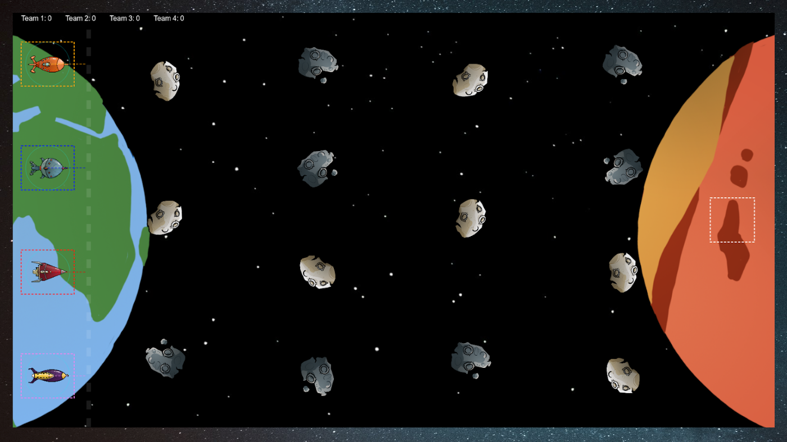
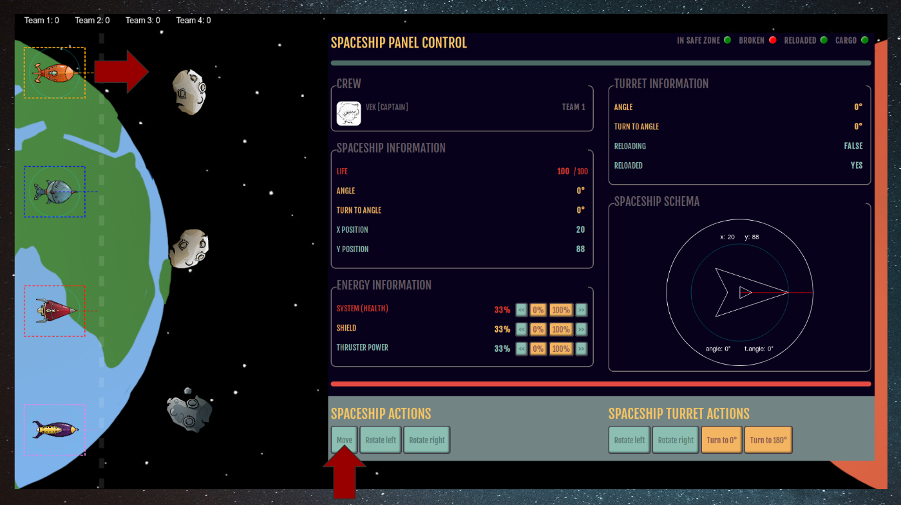

# HTML5 Mars Project

Quatre centres spatiaux en concurrence pour envoyer l’humanité sur Mars. Le projet propose à quatre équipes de développer un tableau de bord pour piloter son vaisseau et marquer des points en faisant des allers retours entre la Terre et Mars.



## But du jeu

Apporter une cargaison d'humains sur Mars. Chaque aller retour fait marquer 1 point, mais attention aux astéroides ainsi qu'aux autres joueurs et leurs missiles.

Pour ce faire, chaque équipe doit développer leur tableau de bord pour piloter leur vaisseau en utilisant les WebSocket pour communiquer avec le serveur. Une exemple de tableau de bord est disponible sur [http://beelab.tk:9090/controller](http://beelab.tk:9090/controller) et le plateau de jeu est disponible sur [http://beelab.tk:9090](http://beelab.tk:9090).



## Les commandes

### Pilote

 - `spaceship:move` Déplace le vaisseau en ligne droite
    * time : En milliseconde, temps que le vaisseau se déplace
    * power : Entre ]0;1] puissance des propulseurs


 - `spaceship:rotate` Tourne le vaisseau sur lui même
    * angle : En degré, angle de rotation
    * direction : Soit 1, soit - 1, sens de rotation


 - `spaceship:turnto` Définit l'angle de rotation du vaisseau
    * angle : En degré, définit l'angle de rotation

### Artilleur

 - `spaceship:turret:rotate` Tourne la tourelle du vaisseau
    * angle : En degré, angle de rotation
    * direction : Soit 1, soit - 1, sens de rotation


 - `spaceship:turret:turnto` Définit l'angle de rotation de la tourelle
    * angle : En degré, définit l'angle de rotation


 - `spaceship:turret:fire` Fait tirer la tourelle
    * power : Entre ]0;1] puissance du missile

### Ingénieur

 - `spaceship:thruster:power` Définit le niveau d'énergie des propulseurs
    * power : Entre ]0;1] niveau d'énergie


 - `spaceship:shield:power` Définit le niveau d'énergie du bouclier
    * power : Entre ]0;1] niveau d'énergie


 - `spaceship:system:power` Définit le niveau d'énergie du système de survie
    * power : Entre ]0;1] niveau d'énergie

### Exemple

```javascript
    const ws = new WebSocket(`ws://localhost:8080?team=1&username=vek&job=Captain`);
    ws.send(JSON.stringify({ name: 'spaceship:move', data: { time: 1000 }})); // Move spaceship for 1s
```

## Information du vaisseau

Lorsqu'une connexion est ouverte avec le serveur, celui-ci envoie les informations du vaisseaux toutes les secondes.

```javascript
{
    "team": 1,                  // Numéro de l'équipe
    "angle": 0,                 // Angle de rotation du vaisseau
    "broken": false,            // Est ce que le vaisseau est en panne
    "cargo": true,              // Est ce que le vaisseau possède une cargaison
    "inSafeZone": false,        // Est ce que le vaisseau est dans la zone sécurisée (Terre)
    "life": 100,                // Nombre de point de vie
    "reloaded": true,           // Est ce que le vaisseau est chargé
    "reloading": false,         // Est ce que le vaisseau est en train de charger un missile
    "shieldPower": 0.33,        // Niveau d'énergie du bouclier
    "systemPower": 0.33,        // Niveau d'énergie de système de survie
    "thrusterPower": 0.33,      // Niveau d'énergie des propulseurs
    "turnDirection": 1,         // Direction de rotation du vaisseau
    "turnTo": 0,                // Rotation du vaisseau
    "turretAngle": 135,         // Angle de rotation de la tourelle
    "turretTurnDirection": 1,   // Direction de rotation de la tourelle
    "turretTurnTo": 0,          // Rotation de la tourelle
    "x": 173,                   // Position X du vaisseau
    "y": 62                     // Position Y du vaisseau
}
```

## Informations diverses

Lorsqu'un vaisseau passe en dessous des 25 pts de vie, celui-ci ne peut plus bouger et doit être réparé.

Plus un missile est tiré puissamment, plus le temps d'attente de recharge est long, mais le missile gagne en rapidité.

Les niveaux d'énergie sont répartis équitablement pour faire 100%. Ainsi monter l'énergie du bouclier fera baisser les niveaux des propulseurs et du système de survie.

Le bouclier permet de réduire les dégats des missiles et des collisions avec les astéroides et vaisseaux.

Le système de survie permet de réparer plus rapidement le vaisseau.

Les vaisseaux ne peuvent pas tirer dans la zone de départ (la Terre).

## Usage

Avec Node JS

```bash
$ git clone https://github.com/kevinbalicot/html5-mars-project.git
$ cd html5-mars-project && npm install
$ node server.js
```

Ouvrez votre navigateur sur http://localhost:8080 ainsi que http://localhost:8080/controller

OU

Avec docker

```bash
$ docker build -t mars/node .
$ docker stack deploy -c docker-compose.yml mars
$ sudo printf "127.0.0.1\tmars.docker" | sudo tee -a /etc/hosts
```

Ouvrez votre navigateur sur http://mars.docker ainsi que http://mars.docker/controller

### Support de cours


 * [JavaScript](https://docs.google.com/presentation/d/1id2U3ZztyoOAfjsveeGzYpiUVU_zSoGrquWGkm_Eg70/edit?usp=sharing)
 * [HTML5 Mars Project](https://docs.google.com/presentation/d/1zOB9d_irVn1iQa5_wlwMv1VMP1NHdozWzjy1IrC7oyQ/edit?usp=sharing)

#### Remerciements

Merci à [@LapierreCarlyne](https://twitter.com/LapierreCarlyne) pour les designs.
